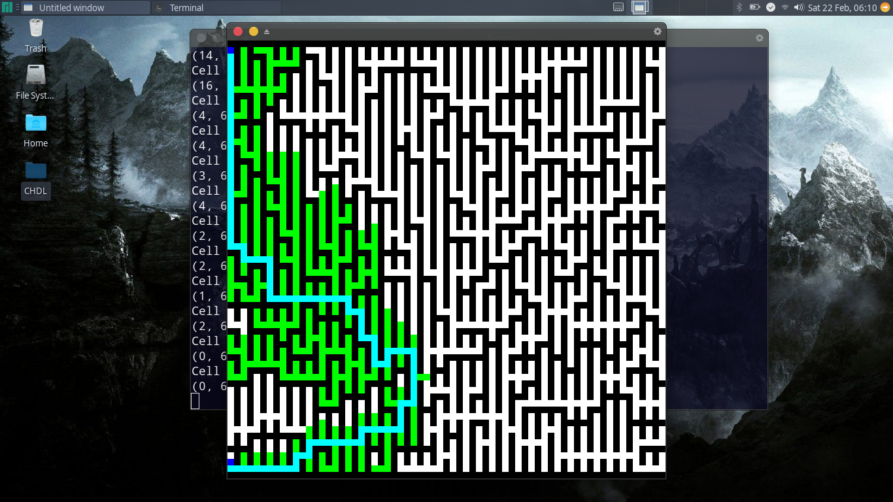
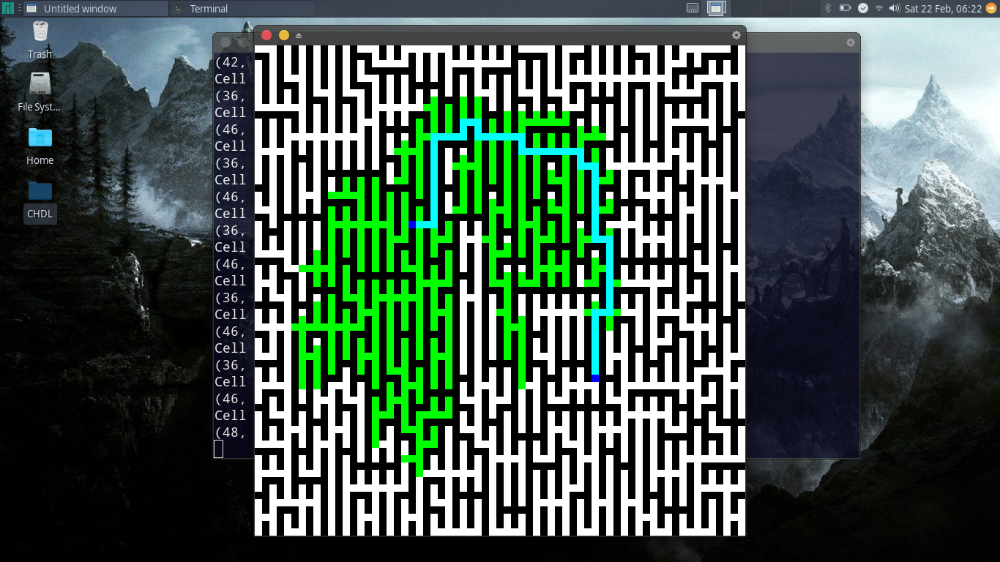

# Pathfinder

measuring and visualizing performance of different pathfinding alogirthms across an aggregated, randomised maze generation algorithm

Some results:

both of these use Manhattan Distance for end heuristic and steps taken so far
for start heuristic. I plan to mess around with the start a little bit, put
less weight on the steps, see if that makes life interesting

and with these, im pushing this project to semi-done, pending bugs. the interactive
interface is very elementary. it mostly just takes in coordinates. I'll probably
work on it a little when im free. also update djikstra(basically just A\* with
no g heuristic) and breath for search (Don't see the point. weighted heuristic
almost always better) soon.

## Contact
*Questions, comments and concerns welcome at solaimanjawad@gmail.com*
